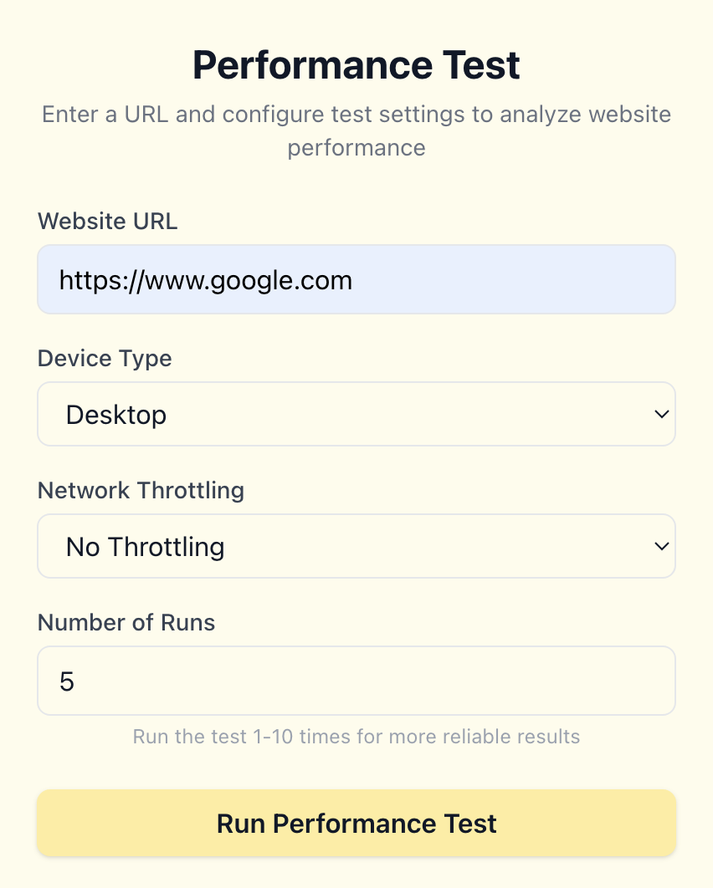
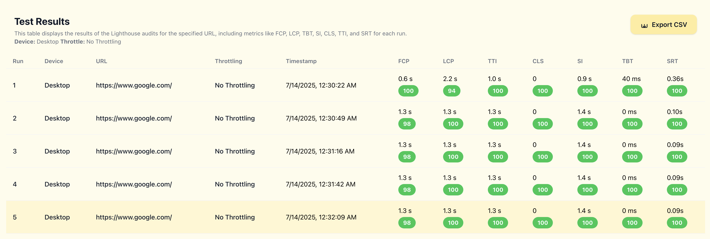
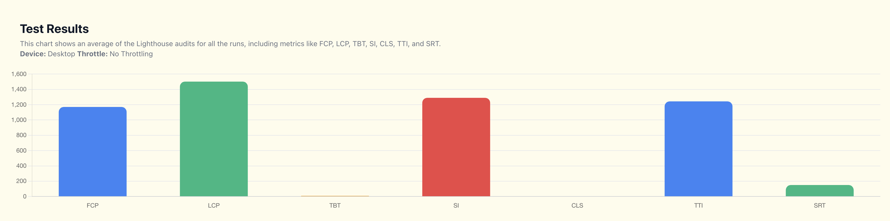

# Performance Lighthouse Runner 🚦


### 🛠️ Getting Started

Prerequisites

- Node.js v18+ installed
- npm or yarn

Backend Setup
```
cd backend
npm install
```

Optional: increase heap if you run many repeats
```
export NODE_OPTIONS="--max-old-space-size=4096"
```

```
node index.js
```

The backend listens on port 3001 and exposes:

GET /run-lighthouse-stream SSE endpoint with query params:

url (string), runs (int), mode (Desktop|Mobile), network (desktop,fast3g,slow3g,none)

Frontend Setup
```
cd frontend
npm install
npm run dev
```

The Vue dev server runs on 5173 and serves the UI.

A **Vue 3** web application to automate **Google Lighthouse audits** for multiple URLs — with advanced features for running tests in batches, averaging results, retrying failed runs, exporting reports, and comparing historical performance data.

---

## 🚀 Features


Device emulation: Test in Desktop or Mobile (emulated) modes.

Network throttling: Choose presets (No Throttle, Fast 3G, Slow 3G) for realistic conditions.

Real-time progress: SSE-based progress bar (Run 3 / 10) without client-side polling.

Result visualization:

Dynamic ResultsTable listing each run’s metrics.

Averages component showing FCP, LCP, TBT, SI, CLS, TTI SRT.

MetricsChart and ComparisonChart powered by Chart.js.

## Performance Test form



## Performance Test Result in Table



## Average of Performance Test Results in Chart



---

### Coming soon

Multi-URL & XML import: Paste newline‑separated URLs or upload an XML sitemap.

Multi-run averaging: Run any URL 1‑N times for stable, averaged Lighthouse scores.

Add more details of the each run in the test.

---

## 🛠️ Tech Stack

- **Frontend:** Vue 3, Vite, Tailwind CSS.
- **Data parsing:** papaparse (`csv`).
- **Charts:** Chart.js (`vue-chartjs`)
- **Backend:** Node.js, Express, Lighthouse CLI (planned)

---

## 📌 Project Goals

✅ Simplify running **Lighthouse audits** for teams.

✅ Automate **batch runs** for more reliable metrics.

✅ Make it easy to **share results** with non-technical stakeholders.

✅ Provide **side-by-side comparisons** for performance regressions.

---

## 🚧 Status

This project is **actively being developed**.
Core goals:
- Build an intuitive **file upload + URL input UI**
- Implement **batch run & retry logic**
- Add **progress tracking** and **live results**
- Deliver clear, shareable **exports & charts**

---

🤝 Contributing

- Fork the repo.
- Create a feature branch (git checkout -b feat/YourFeature).
- Commit your changes (git commit -m "feat: ...").
- Push to branch (git push origin feat/YourFeature).
- Open a Pull Request.

----

## 📄 License

[MIT](LICENSE)
